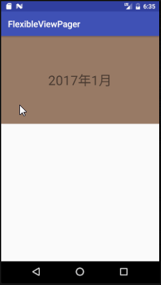

## 巧用ViewPager来显示日历 ##

缘起：

> 提个小问题：如果换一个场景，比如在日历中，我们每滑一下就显示下一个月或上一个月的日历，一般做个日历的话都要可以查询上百年的日期吧，难道我们要传N多个view到ViewPagerAdapter里面吗？显然这是不可能的。如果只用三个view呢，让它们循环使用，这也有个问题，你怎么知道它滑到哪年哪月了呢？难道要自己用个计数器把它记起来？会不会太麻烦？

这个demo就是为了解决上面的问题而生的，解决方案是循环+巧用ViewPagerAdapter的position来实现计数，具体做法请看源码。

下面是效果图：

